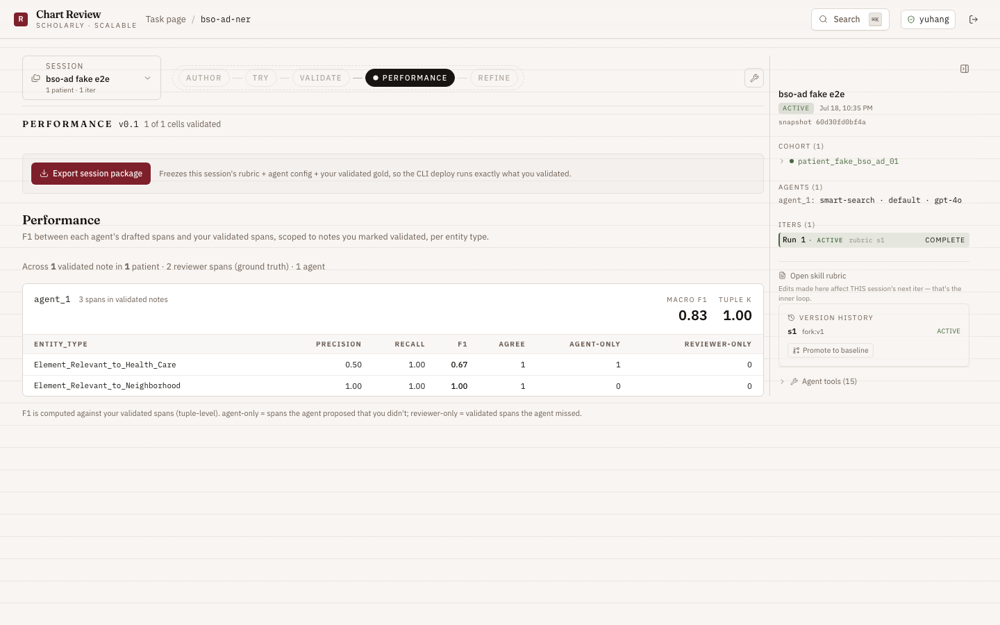
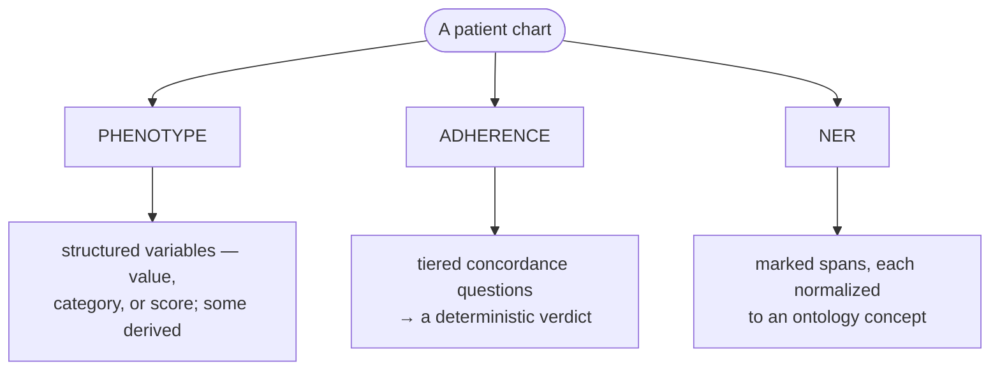
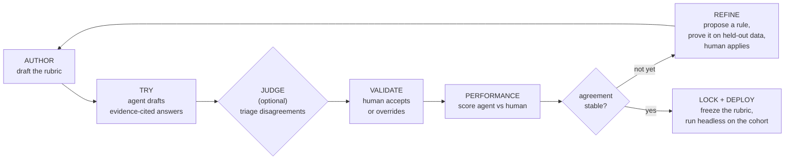
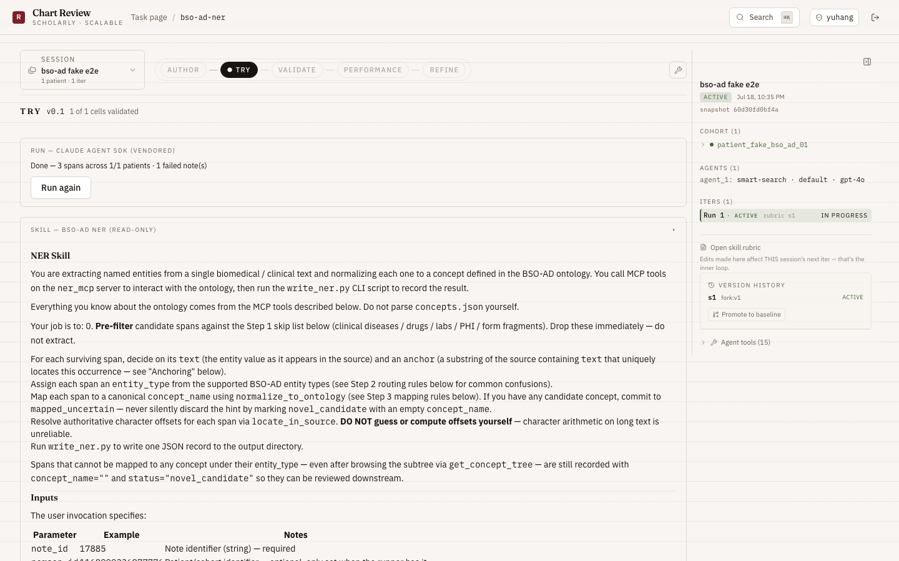
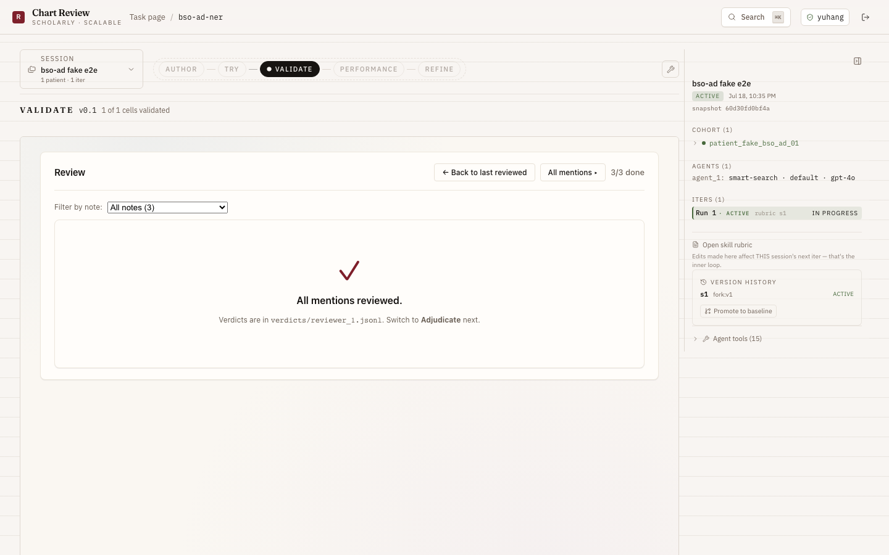

<div align="center">

# 📋 Chart Review

### Agent-assisted clinical chart review — from rubric draft to locked, citable results, in one workspace.

An LLM agent reads every patient's chart and drafts each answer **with the exact quote it used**; a human adjudicates; the rubric **improves itself** from those decisions — until agreement stabilizes and the rubric locks at a git SHA you can cite.


</div>

---

Clinical chart review — reading a record to answer a fixed set of structured questions — is a bottleneck in observational research: slow, expensive, and hard to reproduce. This platform puts an LLM **agent** in front of the human reviewer as a *first-drafter*. Three properties make it more than "an LLM with a form":

- ✅ **Every answer carries a machine-verified quote.** A write is rejected if the cited text isn't actually in the note. The agent cannot invent evidence.
- 🔁 **Every run is reproducible.** The rubric is versioned; a validated task exports as a package and re-runs headlessly on a new cohort with the same prompt and model.
- ♻️ **The rubric improves itself.** From the reviewer's own decisions, the platform proposes concrete, held-out-validated rubric edits — surfaced transparently for a human to apply, never automatically.

<div align="center">



<sub><b>PERFORMANCE</b> — per-entity precision / recall / F1 of each agent against the reviewer's validated gold.</sub>

</div>

## 🔬 Three kinds of review

Every task is one of three kinds. They share the same loop, the same evidence-citation discipline, and the same screens — what differs is the *shape of the question*, and therefore the evidence the agent gathers and how the result is scored.

| Kind | The question it answers | Example tasks | Scored by |
|---|---|---|---|
| **Phenotype** | *What is / does the patient have X?* | `cancer-diagnosis`, `RUCAM` (drug-induced liver injury), `ACTS` (dementia work-up) | per-field accuracy |
| **Adherence** | *Did the documented care follow the guideline?* | `asthma-adherence`, `crc-nccn-adherence`, `lung-cancer-adherence` | Cohen's κ |
| **NER** | *Where in the text is each entity, and what concept is it?* | `bso-ad-ner` (SDOH + dementia ontology) | precision / recall / F1 |



## 🔁 One workspace for the whole loop

A review is a loop, not a one-shot. The methodologist tightens the rubric until the agent and the human agree reliably; then the rubric is frozen and cited.



<div align="center">


<sub><b>TRY</b> — the agent reads each note and drafts answers; the rubric it's following is shown read-only alongside.</sub>


<sub><b>VALIDATE</b> — the reviewer confirms, corrects, or rejects each drafted answer; their decisions become the gold standard.</sub>

</div>

## ✅ Every answer is backed by a verified quote

The single most important guardrail: **the agent cannot cite evidence that isn't there.** Every answer must include a verbatim quote from the note, and the platform checks that quote against the note's actual bytes before the write is accepted. If the quote is present but the offsets are slightly off, the gate auto-corrects them; if the quote is absent from the note, the write is rejected — no fabricated evidence.

The reviewer never has to wonder whether a quote is real. If it displays, it was found in the chart.

## ♻️ The rubric improves itself — transparently

When the agent and reviewer disagree, that's a signal. For each mismatch the platform runs an **error analysis** — *rubric gap*, *genuine ambiguity*, or *model slip*? — and for real gaps it proposes a **generalizable rule**, then **validates it on a held-out split** (how many cases it fixes vs. regresses) and surfaces a card showing the wrong example, the proposed edit, and the proof.

The reviewer decides. Nothing is applied automatically; a model slip is never turned into a rule; every applied edit is versioned and revertable. The rubric gets tighter *because* a human and an agent disagreed — and you can see exactly why it changed.

## 🚀 Quick start

### Prerequisites

| Requirement | Notes |
|---|---|
| **Node.js** ≥ 20 | runs the server + client |
| **Python** ≥ 3.11 | the agent sidecar (use [`uv`](https://github.com/astral-sh/uv)) |
| **A model backend** | Azure OpenAI, a vLLM endpoint, or an OpenRouter key |

### Run it

```sh
# 1. install
npm install
cd python && uv venv .venv --python 3.11 && uv pip install -e . && cd ..

# 2. configure
cp .env.example .env        # then edit — set AGENT_PROVIDER, the model backend, and CHART_REVIEW_PLATFORM_ROOT

# 3. start the dev server (Express on :3002, Vite on :5174)
npm run dev
```

Open **http://localhost:5174**, sign in with any reviewer ID, and select the `cancer-diagnosis` task to walk the full loop end to end.

## 🔌 Configuring the API + LLM

The agent needs a model backend. Set **one** in your `.env` (copied from `.env.example`):

| Backend | Set `DEEPAGENTS_LLM_BACKEND` to | Then provide |
|---|---|---|
| **Azure OpenAI** *(tested — `gpt-4o`)* | `azure` | `AZURE_OPENAI_API_KEY`, `AZURE_OPENAI_ENDPOINT`, `AZURE_OPENAI_API_VERSION`, `AZURE_OPENAI_DEPLOYMENT` |
| **vLLM** *(self-hosted, e.g. Qwen3-32B)* | `vllm` | `VLLM_BASE_URL`, `VLLM_MODEL`, `VLLM_API_KEY` (any non-empty string) |

A minimal Azure `.env`:

```sh
CHART_REVIEW_PLATFORM_ROOT=/abs/path/to/chart-review-platform
AGENT_PROVIDER=deepagents
MCP_TRANSPORT=subprocess
DEEPAGENTS_PYTHON=/abs/path/to/python/.venv/bin/python

DEEPAGENTS_LLM_BACKEND=azure
AZURE_OPENAI_API_KEY=<your key>
AZURE_OPENAI_ENDPOINT=https://<resource>.openai.azure.com/
AZURE_OPENAI_API_VERSION=2024-06-01
AZURE_OPENAI_DEPLOYMENT=gpt-4o
```

> **🔒 PHI safety.** Set `CHART_REVIEW_PHI_MODEL` to an in-BAA model (e.g. `gpt-4o` on Azure, or a truly local vLLM). PHI-flagged patients route there regardless of the default; if it's unset and a PHI patient appears, the run **fails loudly** rather than leaking data outside the BAA boundary.

**NER tasks** (`bso-ad-ner`) run a vendored Claude-Agent-SDK through a small local proxy on `:18080` that picks the provider from the API-key *prefix*. Put the key in `vendor/bso-ad-sdk/.env` as `ANTHROPIC_API_KEY`, and use a **provider-namespaced** model id in the session:

| Provider | `ANTHROPIC_API_KEY` format | Example model id |
|---|---|---|
| Azure OpenAI | `azure:<endpoint>:<key>` *(auto-built from `AZURE_OPENAI_*`)* | `gpt-4o` |
| OpenRouter | `sk-or-v1-…` | `anthropic/claude-sonnet-4.6`, `openai/gpt-4o` |
| OpenAI | `sk-…` | `gpt-4o` |

Start the proxy once, in its own terminal:

```sh
cd vendor/bso-ad-sdk
env -u ANTHROPIC_API_KEY .venv/bin/uvicorn claude_proxy.proxy:app --port 18080
```

## 📦 Deploy on a whole cohort

Once a task agrees reliably with the reviewer, export it as a package and run the validated agent **headlessly** on a new cohort — no UI, one command:

```sh
npm run deploy -- \
  --package var/exports/<task>/<exportId> \
  --data-dir /path/to/cohort \      # <patient_id>/notes/*.txt
  --out /path/to/results
```

Each patient gets a JSON answer file with cited evidence; the run emits a per-patient CSV and a manifest recording the model and pass/fail counts, and warns if the configured model differs from the one the package was validated on.

## 🗂️ Repository layout

```
chart-review-platform/
├── .claude/skills/          rubric trees (one per task) + promoted versions
├── client/                  React 18 + Tailwind + Radix Studio UI
├── server/                  Express + WebSocket (routes, MCP, agent provider)
├── packages/                storage · domain-review · mcp-server · agent-provider · …
├── python/                  the agent sidecar (deepagents + langchain)
├── corpus/                  patient notes (synthetic; real/PHI are gitignored)
└── docs/                    design narrative + technical report
```

## 🤝 Conventions

- **Feature branches** (`feat/…`, `fix/…`, `docs/…`), **conventional commits**, **`--no-ff`** merges.
- **No secrets in commits** — `.env` is gitignored; real/PHI patient data (`patient_real_*`, `patient_private_*`) never leaves the team.
- **Faithfulness first** — any new write tool must route its note evidence through the same quote-verification gate.

## 📄 License

Private / unlicensed pending decision. Do not redistribute patient notes or reviewer-validated `review_state.json` files outside the team.
