# Chart Review Platform — End-to-end User Manual

*Generated 2026-05-03. Companion to `docs/OVERVIEW.md` (concepts) and the post-MVP blueprint (architecture).*

This manual is **task-oriented**. Each section walks one user journey end-to-end with screenshots. Three audiences:

| Role | Read first | Skip |
|---|---|---|
| **Methodologist** (you own the rubric, ship the paper) | All sections | — |
| **Reviewer** (you validate patients) | §3 (Reviewer's day) only | §4–§9 |
| **Engineer / collaborator** | §1 (orientation), §10 (API), §11 (skills) | §2–§5 unless deploying |

---

## 1. Orientation

The platform has three concentric surfaces, each with its own UI tab and skill family.

```
┌─ Calibration phase ─────────────────────────────────────────┐
│   Pilots tab    →    Calibration tab    →    Rules tab      │
│   (run agents)       (compute κ)              (act on κ)    │
│                                                              │
│   Skill family: chart-review-{author, build, calibrate,     │
│                                improve, copilot}            │
└──────────────────────────────────────────────────────────────┘
                            │ (lock)
                            ▼
┌─ Deployment phase ──────────────────────────────────────────┐
│   Cohorts tab   →   Sample queue   →   Issues tab           │
│   (deploy agent)    (validate)         (triage + promote)   │
│                                                              │
│   Skill family: chart-review-{cohort, methods}              │
└──────────────────────────────────────────────────────────────┘
                            │ (publication)
                            ▼
┌─ Reproducibility ───────────────────────────────────────────┐
│   Bundles tab  →  exports/<task>/<ts>/  (.tar.gz)           │
└──────────────────────────────────────────────────────────────┘
```

The Studio (the v2 methodologist surface) has 8 tabs. Pilots / Calibration / Rules / Methods / Bundles / Authoring are calibration-side. Cohorts / Issues are deployment-side. Bundles cross both.

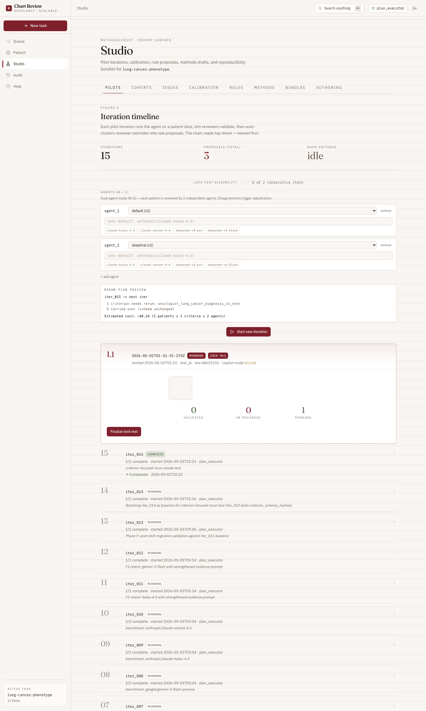

**Login** is optional in the default `REVIEWER_AUTH=optional` mode — anyone can hit the API as `anonymous-reviewer`. For methodologist actions (lock, draw sample, triage, promote, export), you need to sign in with a reviewer_id that's flagged methodologist.

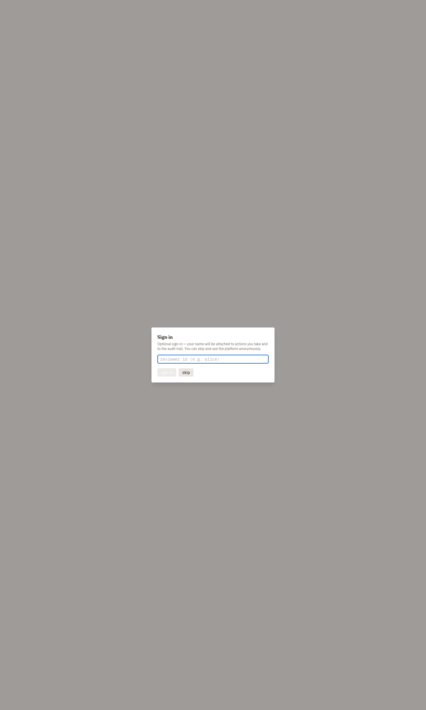

---

## 2. Methodologist's day — calibration phase

The calibration phase iterates pilot runs against a small developer cohort until inter-rater agreement crosses a threshold. Each iter is one round of: agent runs → reviewer validates → auto-critique clusters override patterns into proposals → methodologist accepts/rejects proposals.

### 2.1 Pilots tab

The Pilots tab is the calibration cockpit. Each row is one iteration. Newest first.

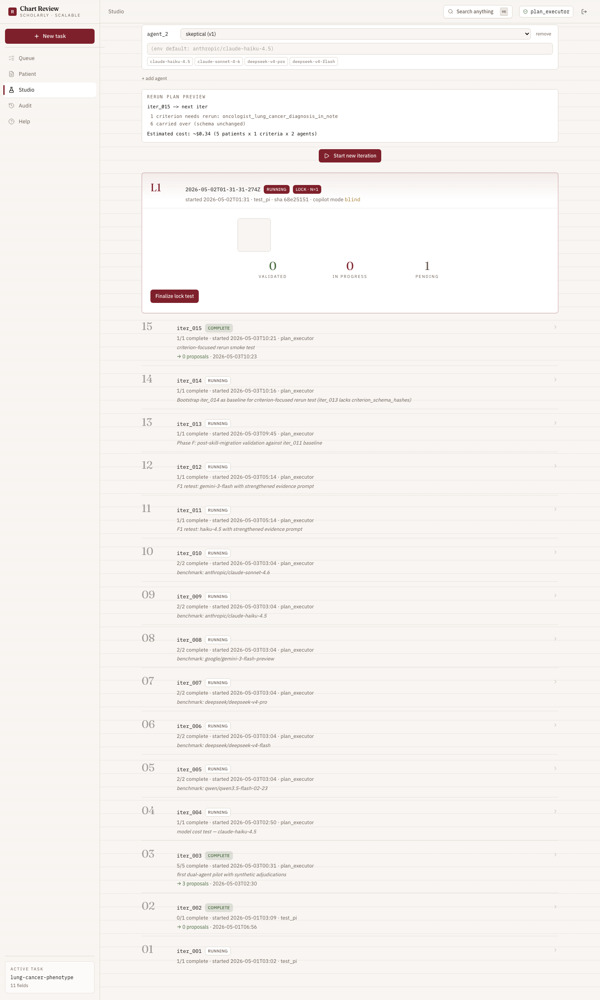

**Per-row anatomy**:
- `01` — iteration index (newest gets the highest number)
- `iter_NNN` — the iter id
- State badge: `complete` / `running` / `ready · validate`
- `n_complete/n_patients` — agent progress
- `worst · avg` — accuracy summary once auto-critique has finished
- `→ N proposals` — number of rule edits the auto-critique surfaced

Click any row to expand and see per-criterion breakdown (`IterDetail`).

**Starting a new iter**: the "Start new iteration" button at the top runs the agent against `dev_patient_ids` from the cohort sampling config. The agent specs panel above the button lets you change agent count, model, and role preset. The "Rerun preview" banner shows which criteria carry forward (unchanged schema_hash) vs which need rerunning (criterion-level rerun design — saves cost on iterations that only edit a few criteria).

### 2.2 Calibration tab

Once you have ≥1 pilot iter complete, the Calibration tab shows per-criterion κ across iterations. Sorted by κ ascending so the worst criterion is at the top — the one most likely to need a rule proposal.

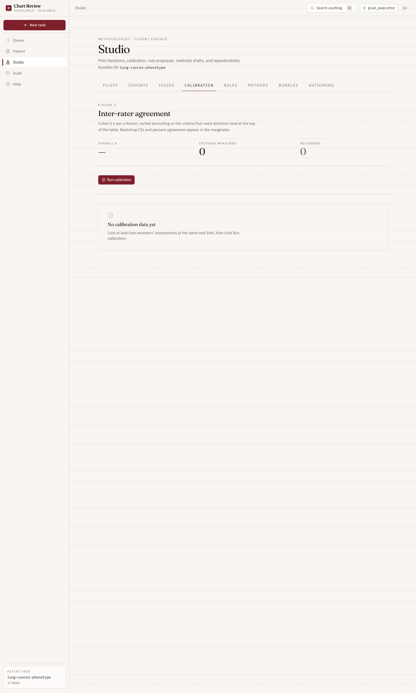

### 2.3 Rules tab

The Rules tab lists every rule proposal across all pilots. Each proposal is the auto-critique's attempt to translate a cluster of reviewer overrides into a concrete edge case + extraction guidance edit. Methodologist accepts (writes to the rubric, bumps the SHA, increments `manual_version`) or rejects (closes; stays as historical record).

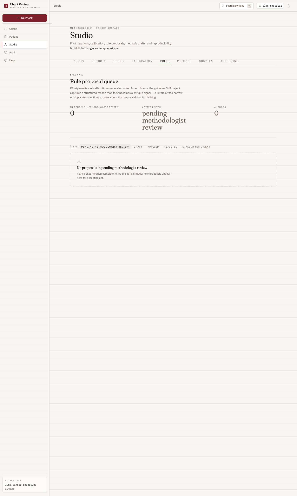

A proposal's lifecycle: `draft` → `accepted | rejected`. Accepted proposals leave a paper trail in `proposals/<task>/<id>.yaml` with diff vs the rubric.

### 2.4 Lock

When `eligibility` flips green (the platform's rule: ≥3 consecutive iters with no critical-criterion κ regression), the Pilots tab surfaces a "Run lock test" button. Lock-test is a hold-out cohort run; passing it transitions the rubric from `draft` to `locked` at a specific SHA. Locked rubrics are citeable.

---

## 3. Reviewer's day

Reviewers don't usually live in the Studio — they live in the **Patient view**, accessed from the Queue or by clicking a patient ID anywhere in the app.

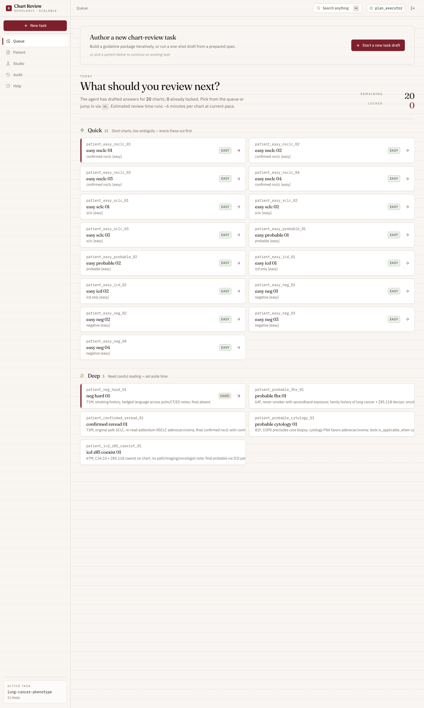

A patient×task lands you in either:
- **Single-agent layout** — one agent draft, one reviewer; the classic flow
- **Dual-agent layout** — two agent drafts side-by-side with the AdjudicationForm; only when the most recent run for this task had ≥2 agents

**The reviewer's job per criterion**: read the agent's draft answer + cited evidence, decide whether to approve or override. Override = type a new answer + write an `edit_reason` + leave a `rationale`. The platform records both the original agent draft (frozen) and your override.

Reviewer has access to the **chart-review-copilot** skill — a read-only Q&A surface for "why did the agent pick X?", "show me evidence against this", "what does the guideline say about Y?". Doesn't commit answers; only the structured form does.

When all leaf criteria are committed and you click **Lock review**, the review_state's `lock_task_sha` is stamped to the current rubric SHA. Locked reviews are immutable from the UI.

---

## 4. Methodologist's day — deployment phase

After lock, you stop iterating on the rubric and start running it on bigger cohorts. The Cohorts tab is the surface for this.

### 4.1 Cohorts tab

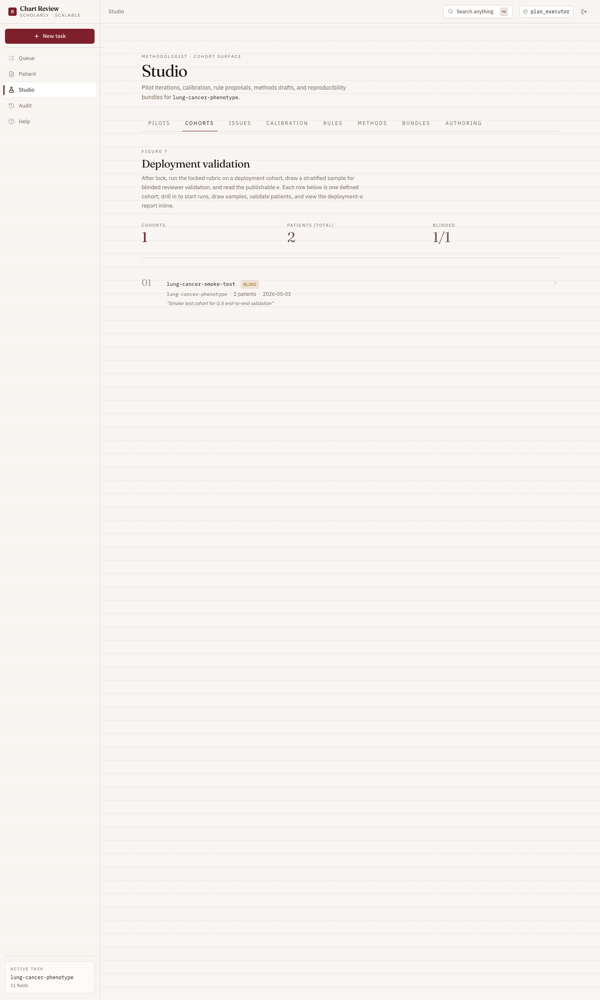

Each row is one defined cohort. The smoke-test cohort (`lung-cancer-smoke-test`, 2 patients, blinded) is the example shown.

Click a cohort to drill into its detail view.

### 4.2 Cohort detail — manifest + runs

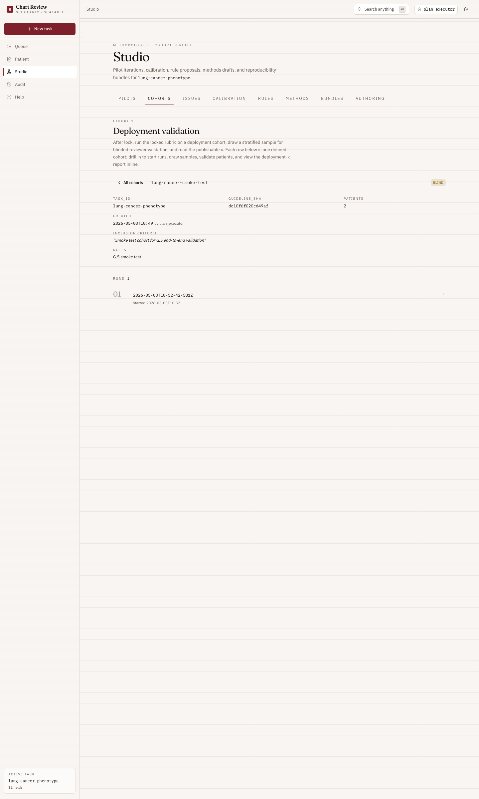

**Manifest** (top) carries the immutable cohort definition: `task_id`, `guideline_sha` (frozen at the SHA used for runs against this cohort), patient_ids, inclusion criteria text (free-form prose), notes. The `guideline_sha` is what later cites in the methods section.

**Runs** (below) are agent invocations against this cohort. Each run produces per-patient agent drafts. Click a run to open its sample queue.

### 4.3 Sample queue + deployment-κ

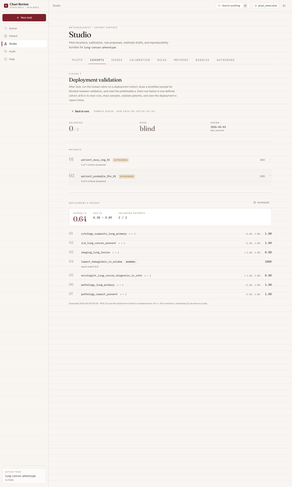

A sample queue is a stratified subset of the run's patients drawn for blinded human validation. Stat block at the top shows Validated/Total, Mode (blind/open), Drawn date+drawer.

Per-patient row: patient_id, validation status, criterion-progress percentage. Click into any row to validate.

The bottom of the page is the **Deployment κ report panel** — agent-vs-reviewer agreement for the criteria that got validated.


**What you read from it**:
- **Overall κ** + 95% CI — the publishable accuracy number for blocks 5–6 of the methods section
- **Per-criterion** κ + CI for categorical criteria, exact-match rate for numeric criteria
- **Calibration κ (Δ)** column — calibration κ for the same criterion (inter-rater on locked reviews) and the gap. ⚠ flag when |Δ| > 0.10 — investigate
- Recompute with the button at the top right; the persisted report is at `cohorts/<id>/reports/<run>/deployment-kappa.{json,md}`

### 4.4 Issues tab — production triage

When deployed, end-users (clinicians, downstream researchers) flag field issues. The Issues tab is where the methodologist triages them.

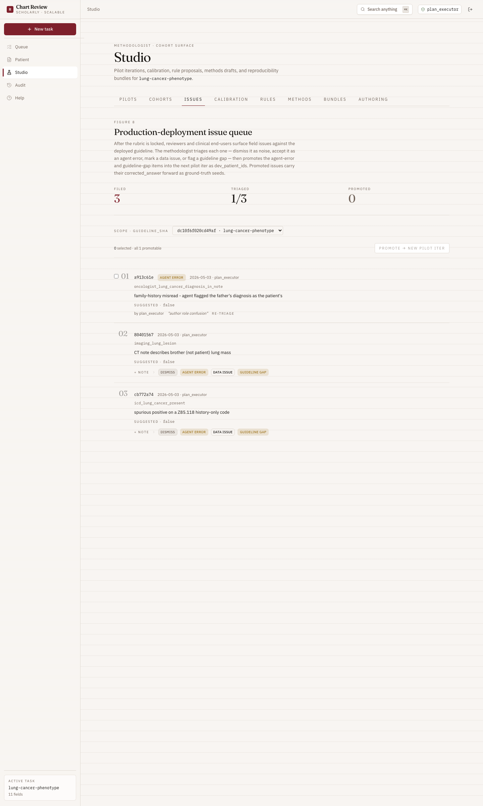

**Per row**:
- `01` — index
- `<8-char id>` — issue id
- Triage badge once classified
- Reporter + date
- Field locator (criterion id) when scoped to one criterion
- Description as substantive prose
- Suggested correction line (italic)
- Triage controls: 4 horizontal badge-buttons for {dismiss, agent_error, data_issue, guideline_gap}

**Promote action** (above the list when promotable items exist): select agent_error/guideline_gap items via the checkboxes, click **Promote → new pilot iter**. The platform creates a new pilot iter with the unique `patient_id`s as `dev_patient_ids` and stamps each promoted issue with the iter_id (so it can't be re-promoted).

This closes the deployment→calibration loop: the methodologist sees real-world failures, picks the ones worth re-pilling, and a fresh iter spawns automatically.

---

## 5. Bundles tab — reproducibility

The Bundles tab packages everything a paper submission would need — the locked rubric, all reviewer locks at that SHA, all agent runs for this task, methods drafts, rule proposals, deployment cohorts and validations, the deployment-issues log — into one self-describing tarball.

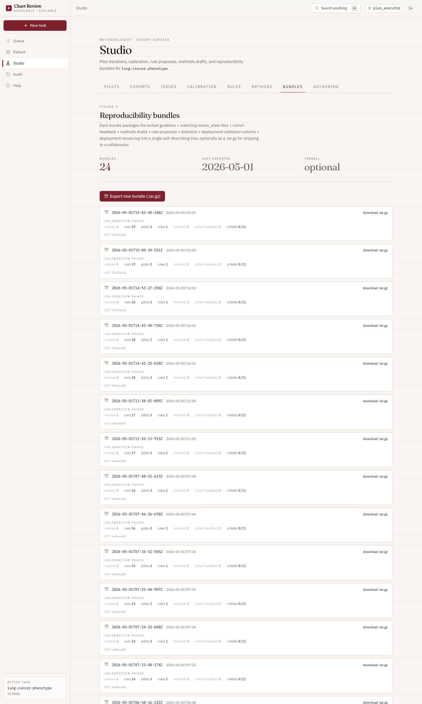

Each row has a download link to the `.tar.gz`. The expanded counter row groups stats into two phases:

- **Calibration phase**: reviews · runs · pilots · rules · methods · cohort feedback · κ fields
- **Deployment phase**: cohorts · samples · validations · κ reports · issues

Zero-valued cells dim 50% — emphasis stays on what's actually in the bundle.

The bundle is the canonical artifact for IRB packets, replication submissions, and methods-section provenance. The companion `chart-review-methods` skill consumes this tree to draft the academic Methods section.

---

## 6. Methods tab

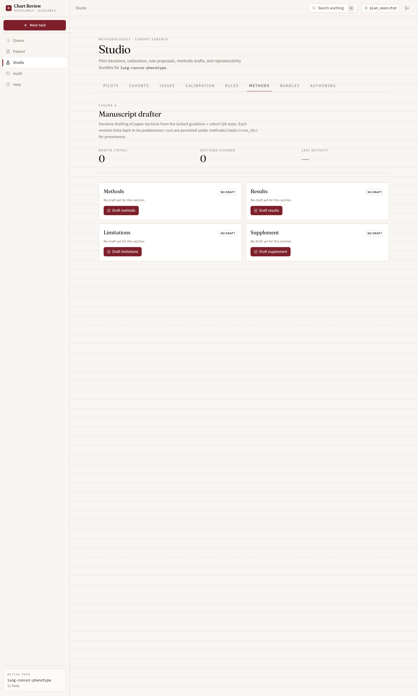

Methods drafts are auto-generated from the locked rubric + the bundle's statistics + (optionally) the deployment-κ report. Each draft is run-keyed under `methods/<task>/<run>/`. Output is past-tense, third-person, ~300–500 words.

Five-paragraph structure (when `deployment_kappa_path` is supplied):
1. Phenotype definition + criterion structure overview
2. Calibration cohort + methodology + per-iter κ
3. Reviewer process and inter-rater reliability
4. Deployment-stage validation (NEW — only when deployment-κ exists)
5. Limitations + reproducibility pointers

---

## 7. Authoring tab + Builder

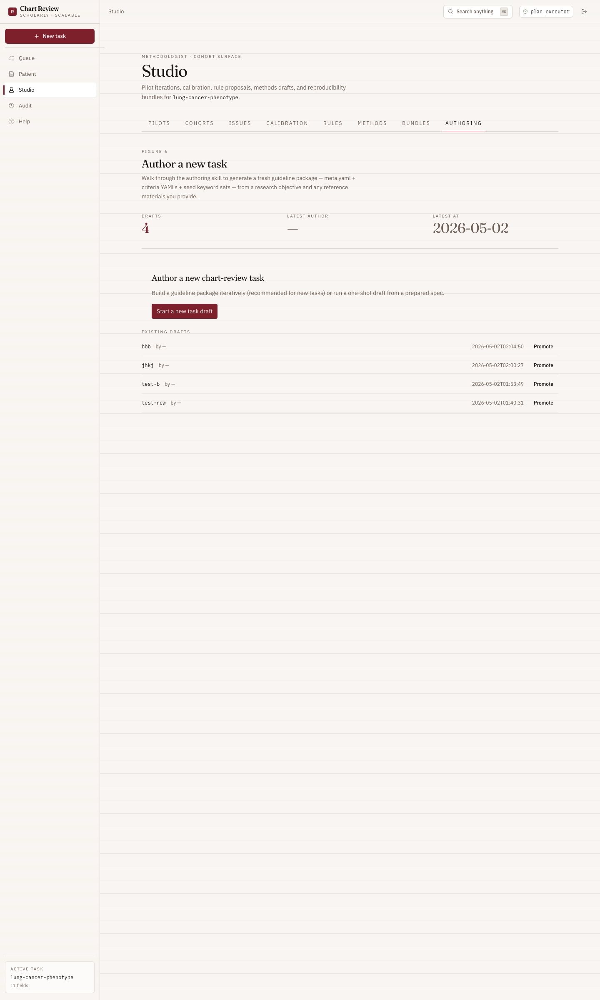

Authoring is where new rubrics get drafted. Two flows:

- **chart-review-author** (one-shot): "Here are some published guidelines + papers; draft me a rubric package." Produces `guidelines/drafts/<task-id>/{meta.yaml, criteria/*.yaml, ...}`.
- **chart-review-build** (interactive): conversational walk-through. Same output shape; step-by-step.

Drafts under `guidelines/drafts/` need to be promoted to `guidelines/<task-id>/` before they show up in the platform's task list.

---

## 8. Audit page

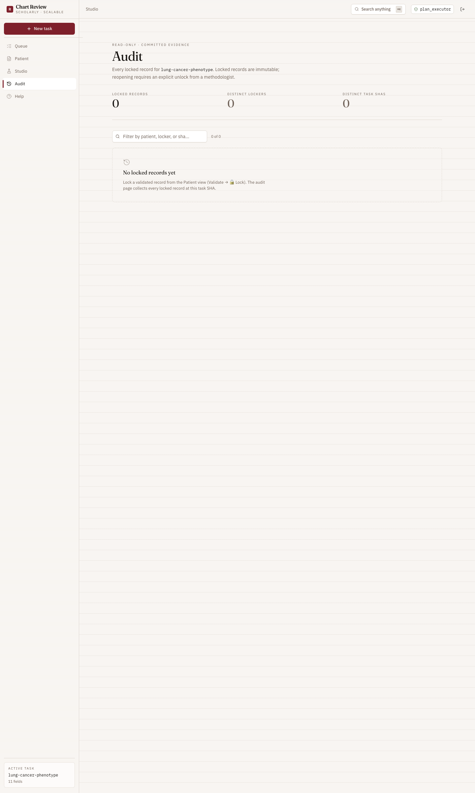

Every committed reviewer assessment, every triage classification, every adjudication, every cohort sample selection lands in an append-only audit trail. The Audit page is the methodologist's read view into that trail.

This page is what an IRB or external auditor reads to verify "did the protocol describe what actually happened?".

---

## 9. Help page

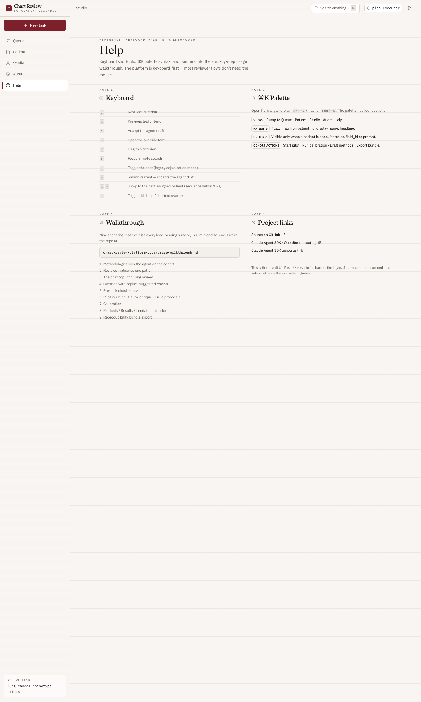

Lightweight in-app reference. The current canonical references live at:
- `docs/OVERVIEW.md` — concepts, why this platform exists
- `docs/superpowers/specs/2026-05-03-post-mvp-blueprint.md` — architecture
- This file — task-oriented walkthroughs

---

## 10. REST API reference

See [api-audit.md](api-audit.md) for the full domain-by-domain REST API breakdown — 16 domains, 28 representative endpoints surveyed live with their response shapes and what each one is for.

**Known quirks** (worth flagging when wiring new clients):

- `GET /api/runs?limit=N` ignores the `limit` query parameter and returns all runs. Filter client-side until that's fixed.
- `GET /api/cohorts` returns `{cohorts: [...]}` — wrapped — while every other list endpoint returns a bare array. The cohort UI handles this; new consumers should too.
- `POST /api/deployment-issues/<sha>` requires `patient_id` + `description` + `reporter_id` (not `summary`/`details`).

---

## 11. Skills reference

See [skills-audit.md](skills-audit.md) for the per-skill audit covering all 9 skills (8 process skills + 1 phenotype scope-skill), their trigger phrases, references, compose-with relationships, and health.

---

## 12. Common workflows — quick recipes

### "Start a new chart-review project from scratch"
1. **Author the rubric**: invoke `chart-review-author` with your published guidelines / SOPs. Produces a draft.
2. **Calibrate**: open Pilots tab; iterate until κ stabilizes.
3. **Lock**: when eligibility flips green, run lock-test, then lock.
4. **Deploy**: define a cohort in the Cohorts tab, run the agent, draw a sample, validate.
5. **Publish**: export bundle from Bundles tab; invoke `chart-review-methods` against it.

### "I'm seeing a bunch of overrides on one criterion"
1. **Calibration tab** → confirm κ for that criterion is below 0.7
2. **Rules tab** → look for proposals that auto-critique already surfaced
3. If none, invoke `chart-review-improve` on that criterion → it samples charts, clusters disagreements, drafts a proposal
4. Accept the proposal → next pilot iter inherits the edit

### "Production users are filing issues against a deployed rubric"
1. **Issues tab** → triage each one
2. Select `agent_error` + `guideline_gap` items → **Promote → new pilot iter**
3. The new iter runs on the promoted patients with the corrected_answer values as ground-truth seeds
4. From here it's a normal calibration iter — review, accept proposals, re-lock

### "We need to ship a paper"
1. Confirm the cohort run completed and the deployment-κ report looks honest (no |Δ| > 0.10 surprises)
2. Bundles tab → Export new bundle (.tar.gz)
3. Invoke `chart-review-methods` with the bundle path + the deployment-kappa.json path
4. Paste the output into the manuscript; cite the locked guideline SHA in the methods

---

---

## Appendix — manual provenance

This manual is generated from the live platform. Three audit passes feed it:

- **Screenshot tour** — Playwright walks every Studio tab, Cohorts → run → sample-queue, Issues with seeded data, Audit, Help. 16 screenshots at `docs/manual/screenshots/`. Viewport is 1440×2400 because the v2 layout uses an inner `overflow:auto` container — full-page captures need the bigger viewport to land all scrollable content.
- **API audit** ([api-audit.md](api-audit.md)) — 28 representative endpoints across 16 domains; 27/28 returned 2xx (the one 4xx was an intentional contract-discovery probe).
- **Skills audit** ([skills-audit.md](skills-audit.md)) — 9/9 skills healthy; all `references/*.md` cross-references resolve; the lung-cancer phenotype scope-skill is structurally sound (11 criteria with frontmatter `field_id` + `answer_schema` + `schema_hash`, all referenced code_sets/keyword_sets/edge_cases/exemplars present).

Re-run the screenshot tour by re-dispatching the playwright agent (see this conversation's git history for the prompt) after UI changes. The audits should be re-run when adding new endpoints or skills.
