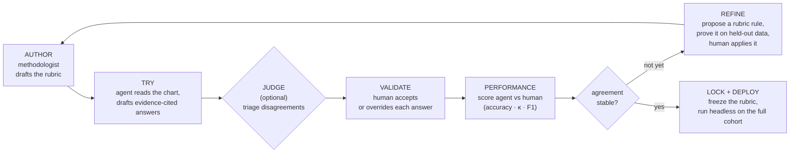
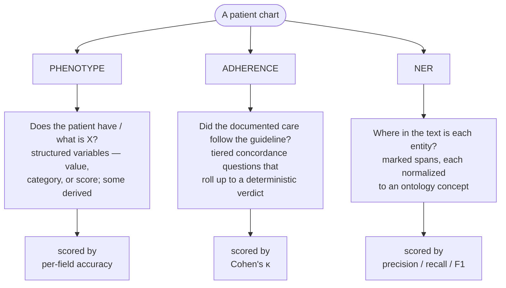
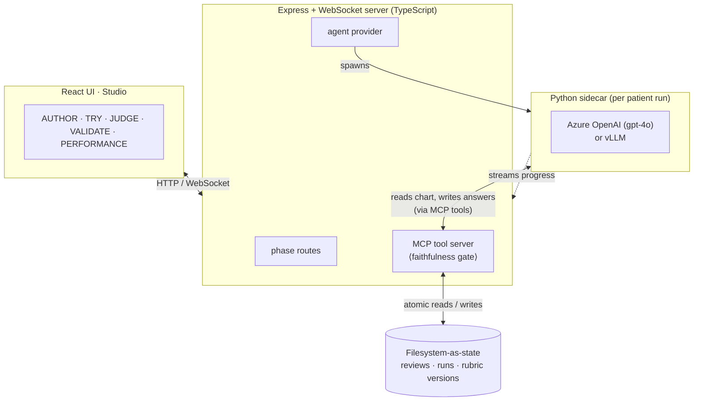

# Chart-Review Platform

**An LLM agent drafts every chart review; a human confirms it; the rubric improves itself — and every answer is backed by a machine-verified quote.**

---

## The problem

Clinical chart review — reading a patient's record to answer a fixed set of
structured questions — is a bottleneck in observational research. Today it is
done by hand: a methodologist writes a rubric, reviewers read every chart,
disagreements are adjudicated, the rubric is revised, and the loop repeats
until agreement stabilizes. It is **slow**, **expensive**, and **hard to
reproduce** — a reviewer's judgment rarely leaves a trail you can audit or
re-run.

## What it is

This platform puts an LLM **agent** in front of the human reviewer as a
*first-drafter*. For each patient the agent reads the notes (and structured
EHR data where available), answers each rubric question, and **cites the exact
text it used**. The reviewer then accepts or overrides each answer. Three
properties make this more than "an LLM with a form":

- **Every answer carries a machine-verified quote.** A write is rejected if the
  cited text is not actually in the note (the *faithfulness gate*). The agent
  cannot invent evidence.
- **Every run is reproducible.** The rubric is versioned; a validated task is
  exported as a package and can be re-run headlessly on a new cohort with the
  same prompt and model.
- **The rubric improves itself.** From the reviewer's own decisions the platform
  proposes concrete, tested rubric edits — surfaced transparently for a human to
  apply, never applied automatically.

## The review loop

A review is a loop, not a one-shot. The methodologist tightens the rubric until
the agent and the human agree reliably; then the rubric is frozen and cited.



## Three kinds of review

Every task is one of three kinds. They share the same loop, the same
evidence-citation discipline, and the same screens — what differs is the *shape
of the question*, and therefore the evidence the agent must gather and how the
result is scored.



| Kind | Example tasks | The question |
|---|---|---|
| **Phenotype** | `cancer-diagnosis`, `RUCAM` (drug-induced liver injury), `ACTS` (dementia work-up) | *What is / does the patient have X?* |
| **Adherence** | `asthma-adherence`, `crc-nccn-adherence`, `lung-cancer-adherence` | *Did care follow the guideline?* |
| **NER** | `bso-ad-ner` | *Where is each entity, and what concept is it?* |

## Why the drafts are trustworthy — the faithfulness gate

The single most important guardrail: **the agent cannot cite evidence that
isn't there.** Every answer the agent writes must include a verbatim quote from
the note. Before the write is accepted, the platform checks that quote against
the note's actual bytes.

```mermaid
sequenceDiagram
    participant Ag as Agent
    participant Gate as Faithfulness gate
    participant Note as Note text
    Ag->>Gate: answer + cited quote + offsets
    Gate->>Note: is the quote present, verbatim?
    alt quote present, offsets off
        Note-->>Gate: found (wrong position)
        Gate->>Gate: auto-correct the offsets
        Gate-->>Ag: accepted
    else quote present at offsets
        Note-->>Gate: found
        Gate-->>Ag: accepted
    else quote absent
        Note-->>Gate: not found
        Gate-->>Ag: rejected — no fabricated evidence
    end
```

The reviewer never has to wonder whether a quote is real. If it displays, it was
found in the chart.

## The rubric improves itself — transparently

When the agent and the reviewer disagree, that disagreement is a signal. For each
mismatch the platform runs an **error analysis** — is this a *rubric gap*, a
*genuine ambiguity*, or a *model slip*? — and for real rubric gaps it proposes a
**generalizable rule** to add. It then **validates that rule on a held-out split**
(how many cases it fixes vs. regresses) and surfaces a card showing the wrong
example, the proposed edit, and the proof.

The reviewer decides. Nothing is applied automatically; a model slip is never
turned into a rule; and every applied edit is versioned and revertable, with its
evidence recorded. The rubric gets tighter *because* a human and an agent
disagreed — and you can see exactly why it changed.

## Under the hood

The UI and the server coordinate through the **filesystem**, not shared memory —
so every run leaves an auditable trail on disk. The agent itself runs in a Python
sidecar driven by Azure OpenAI or a self-hosted (vLLM) model.



## From one chart to a whole cohort

Once a task's rubric agrees reliably with the reviewer, you **export it as a
package** and run the validated agent **headlessly** on a new cohort — no UI, one
command. Each patient gets a JSON answer file with cited evidence; the run emits a
per-patient CSV and a manifest recording the model and the pass/fail counts. If
the configured model differs from the one the package was validated on, the run
warns you.

## Try it

```sh
cd chart-review-platform-concur
npm install
npm run dev          # Express on :3002, Vite on :5174
```

Open `http://localhost:5174`, sign in with any reviewer ID, and select the
`cancer-diagnosis` task to walk the full loop end to end. Full setup (Python
sidecar, model configuration) is in the [README](../README.md); the deeper
design rationale is in the [technical report](technical-report.md).

---

*Clinical notes stay on your infrastructure. Patient notes and reviewer-validated
state are never redistributed outside the team.*
